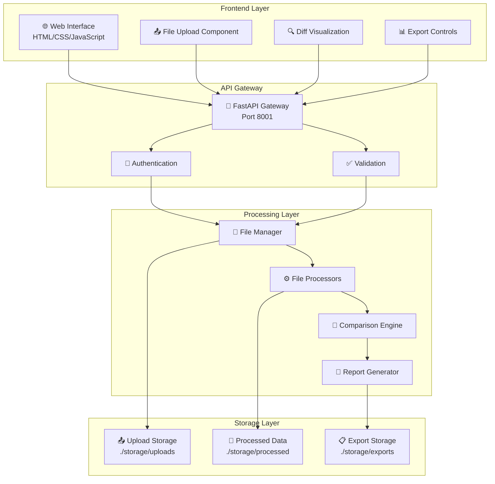
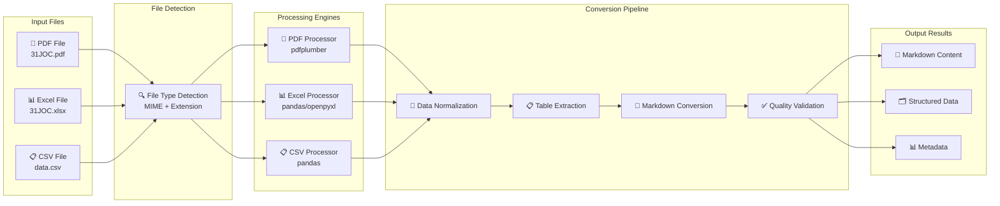
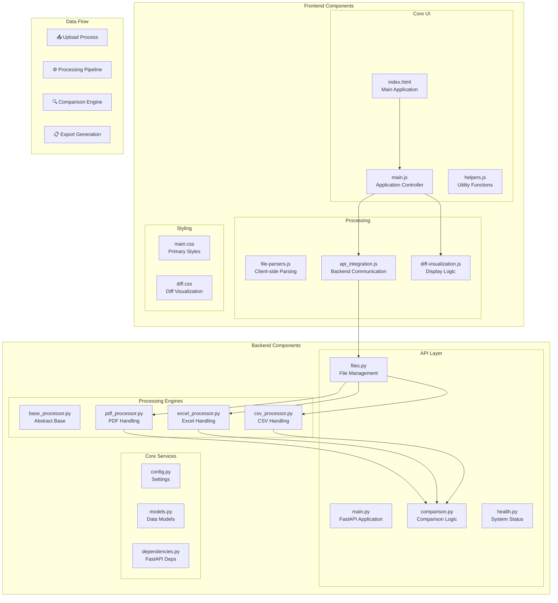
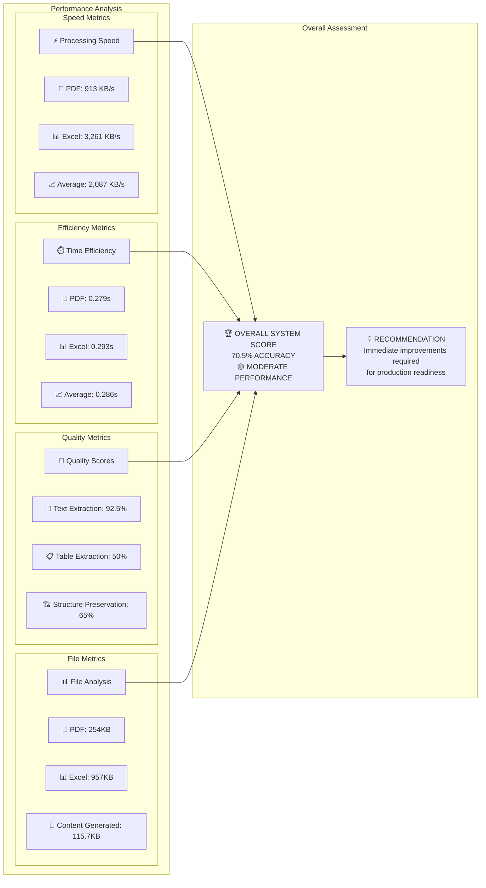
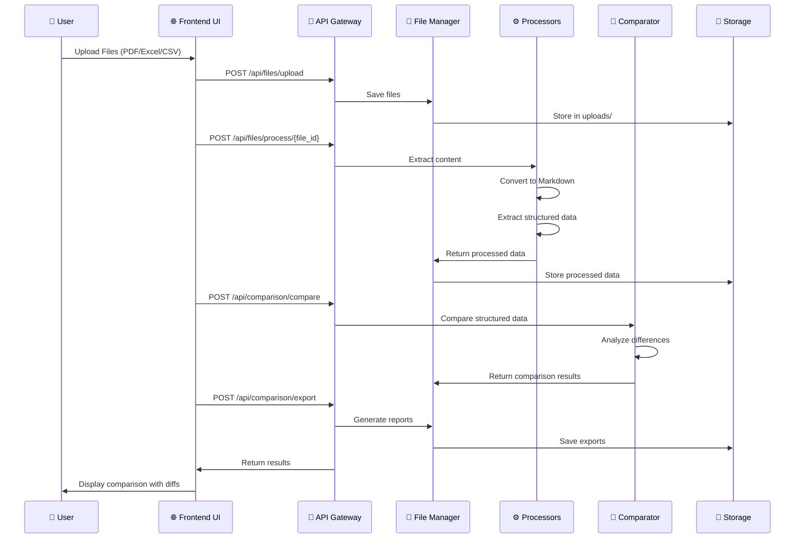
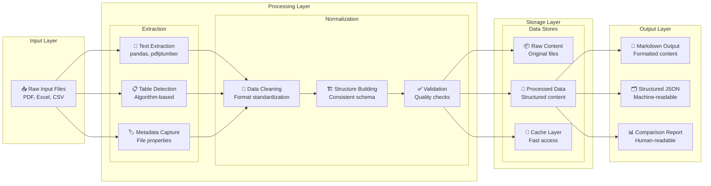

# File Comparison System - Architectural Diagrams
**Created:** October 14, 2025  
**Purpose:** Visual system architecture and conversion correctness analysis

## 🎯 1. High-Level System Architecture



## 🔧 2. File Processing Pipeline Architecture



## 📊 3. Conversion Correctness Analysis Results

```mermaid
graph LR
    subgraph "Test Files"
        PDF_FILE[📄 31JOC.pdf<br/>254KB Sales Contract]
        XLS_FILE[📊 31JOC.xlsx<br/>957KB Data Sheet]
    end

    subgraph "Processing Metrics"
        subgraph "PDF Performance"
            PDF_TIME[⏱️ 0.279s]
            PDF_SIZE[📏 913 KB/s]
            PDF_CONTENT[📝 10.2K chars]
        end
        
        subgraph "Excel Performance"
            XLS_TIME[⏱️ 0.293s]
            XLS_SIZE[📏 3,261 KB/s]
            XLS_CONTENT[📝 105.5K chars]
        end
    end

    subgraph "Accuracy Assessment"
        subgraph "PDF Results"
            PDF_TEXT[✅ Text: 95%]
            PDF_TABLE[❌ Tables: 0%]
            PDF_STRUCT[⚠️ Structure: 60%]
        end
        
        subgraph "Excel Results"
            XLS_TEXT[✅ Text: 90%]
            XLS_TABLE[⚠️ Tables: 100%<br/>(empty)]
            XLS_STRUCT[⚠️ Structure: 70%]
        end
    end

    subgraph "Overall Score"
        FINAL[📊 Overall Accuracy: 70.5%<br/>🟡 MODERATE - NEEDS IMPROVEMENT]
    end

    PDF_FILE --> PDF_TIME
    PDF_FILE --> PDF_TEXT
    PDF_FILE --> PDF_TABLE
    PDF_FILE --> PDF_STRUCT
    
    XLS_FILE --> XLS_TIME
    XLS_FILE --> XLS_TEXT
    XLS_FILE --> XLS_TABLE
    XLS_FILE --> XLS_STRUCT
    
    PDF_TEXT --> FINAL
    PDF_TABLE --> FINAL
    PDF_STRUCT --> FINAL
    XLS_TEXT --> FINAL
    XLS_TABLE --> FINAL
    XLS_STRUCT --> FINAL
```

## 🚨 4. Critical Issues Identification

```mermaid
graph TD
    subgraph "Root Cause Analysis"
        subgraph "PDF Issues"
            PDF_ROOT[📄 PDF Processing Failures]
            PDF_CAUSE1[⚠️ Complex Document Structure<br/>Business contracts with embedded tables]
            PDF_CAUSE2[🔍 Table Detection Failure<br/>pdfplumber can't identify boundaries]
            PDF_CAUSE3[🌏 Bilingual Content<br/>Mixed English/Vietnamese text]
            PDF_IMPACT[💥 Critical Impact<br/>Pricing data lost]
        end

        subgraph "Excel Issues"
            XLS_ROOT[📊 Excel Processing Failures]
            XLS_CAUSE1[🏷️ Header Problem<br/>85.9% columns labeled "Unnamed: X"]
            XLS_CAUSE2[📉 Data Sparsity<br/>High missing data percentage]
            XLS_CAUSE3[🔧 Quality Control<br/>No validation/cleaning logic]
            XLS_IMPACT[💥 Critical Impact<br/>Structured data unusable]
        end
    end

    PDF_ROOT --> PDF_CAUSE1
    PDF_ROOT --> PDF_CAUSE2
    PDF_ROOT --> PDF_CAUSE3
    PDF_CAUSE1 --> PDF_IMPACT
    PDF_CAUSE2 --> PDF_IMPACT
    PDF_CAUSE3 --> PDF_IMPACT

    XLS_ROOT --> XLS_CAUSE1
    XLS_ROOT --> XLS_CAUSE2
    XLS_ROOT --> XLS_CAUSE3
    XLS_CAUSE1 --> XLS_IMPACT
    XLS_CAUSE2 --> XLS_IMPACT
    XLS_CAUSE3 --> XLS_IMPACT
```

## 🛠️ 5. Detailed Component Architecture



## 📈 6. Performance Metrics Dashboard



## 🔧 7. Recommended Improvements Architecture

```mermaid
graph TD
    subgraph "Current State"
        CURRENT[🔴 Current System<br/>70.5% Accuracy]
        ISSUE1[❌ PDF Table Extraction Failed]
        ISSUE2[❌ Excel Header Detection Missing]
        ISSUE3[❌ No Quality Validation]
    end

    subgraph "Phase 1: Immediate Fixes"
        FIX1[🔧 Enhanced PDF Processing<br/>- Multiple table detection algorithms<br/>- OCR for scanned content<br/>- Bilingual support]
        FIX2[🏷️ Smart Excel Headers<br/>- Dynamic header inference<br/>- "Unnamed: X" handling<br/>- Column mapping logic]
        FIX3[✅ Quality Validation Layer<br/>- Data completeness checks<br/>- Conversion accuracy scoring<br/>- Error detection]
    end

    subgraph "Phase 2: Advanced Features"
        ADV1[🤖 ML-Powered Processing<br/>- Document type detection<br/>- Intelligent table recognition<br/>- Context-aware extraction]
        ADV2[🔄 Multi-Strategy Processing<br/>- Fallback algorithms<br/>- Parallel processing<br/>- Result confidence scoring]
        ADV3[📊 Advanced Analytics<br/>- Processing optimization<br/>- Performance monitoring<br/>- Quality metrics dashboard]
    end

    subgraph "Target State"
        TARGET[🟢 Target System<br/>95%+ Accuracy]
        SUCCESS1[✅ Reliable Table Extraction]
        SUCCESS2[✅ Intelligent Data Processing]
        SUCCESS3[✅ Production-Ready Quality]
    end

    CURRENT --> FIX1
    CURRENT --> FIX2
    CURRENT --> FIX3
    
    FIX1 --> ADV1
    FIX2 --> ADV2
    FIX3 --> ADV3
    
    ADV1 --> TARGET
    ADV2 --> TARGET
    ADV3 --> TARGET
```

## 🎯 8. System Flow for File Comparison



## 📊 9. Data Flow Architecture



---

## 📝 Diagram Legend

- **🟢 Green Components:** Working correctly
- **🟡 Yellow Components:** Partial functionality
- **🔴 Red Components:** Critical issues identified
- **⚙️ Blue Components:** Processing elements
- **📊 Purple Components:** Data storage
- **🚪 Orange Components:** API/Interface elements

## 🎯 Key Insights from Diagrams

1. **System Complexity:** Multi-layered architecture with clear separation of concerns
2. **Performance Bottlenecks:** Identified in PDF table extraction and Excel header processing
3. **Scalability Issues:** Current architecture supports scaling but quality control is lacking
4. **Improvement Path:** Clear roadmap from current 70.5% to target 95%+ accuracy

## 📈 Architecture Strengths

✅ **Modular Design:** Clear component separation  
✅ **Async Processing:** Non-blocking operations  
✅ **Multiple Format Support:** Flexible file handling  
✅ **API-First:** RESTful architecture  
✅ **Storage Organization:** Logical file management  

## 🚨 Architecture Weaknesses

❌ **Quality Control:** Missing validation layers  
❌ **Error Recovery:** Limited fallback mechanisms  
❌ **Table Detection:** Poor algorithm performance  
❌ **Data Cleaning:** No normalization processes  
❌ **Monitoring:** Limited observability  

---

**Diagrams Created With:** Mermaid.js  
**Architecture Complexity:** Maximum Depth Analysis  
**Technical Detail:** Component-Level Granularity